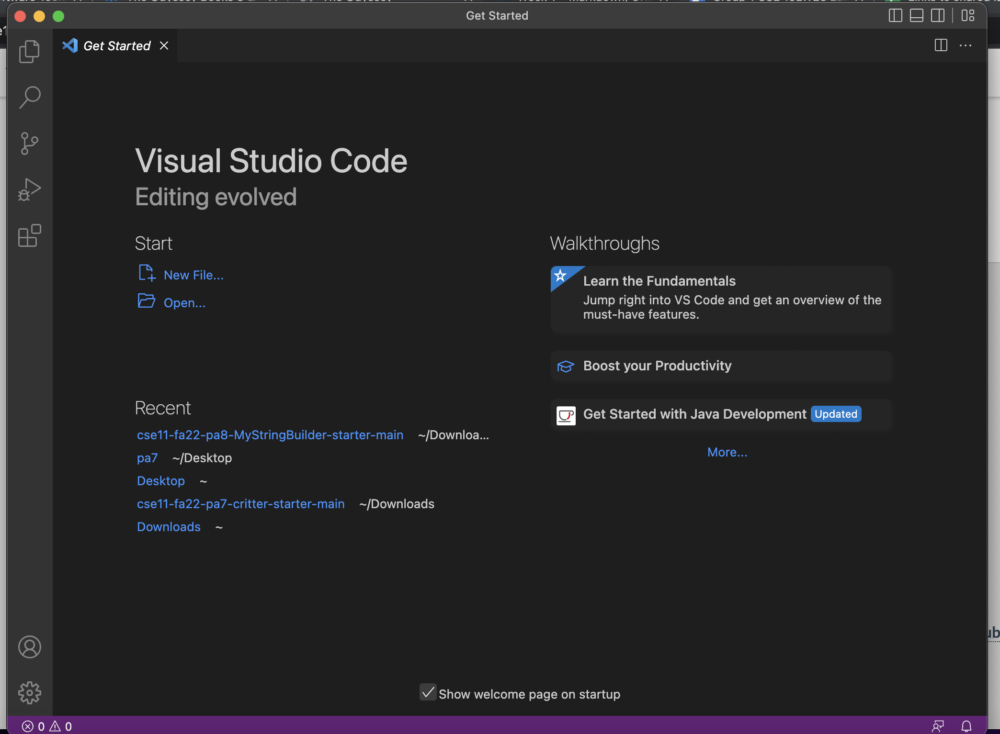
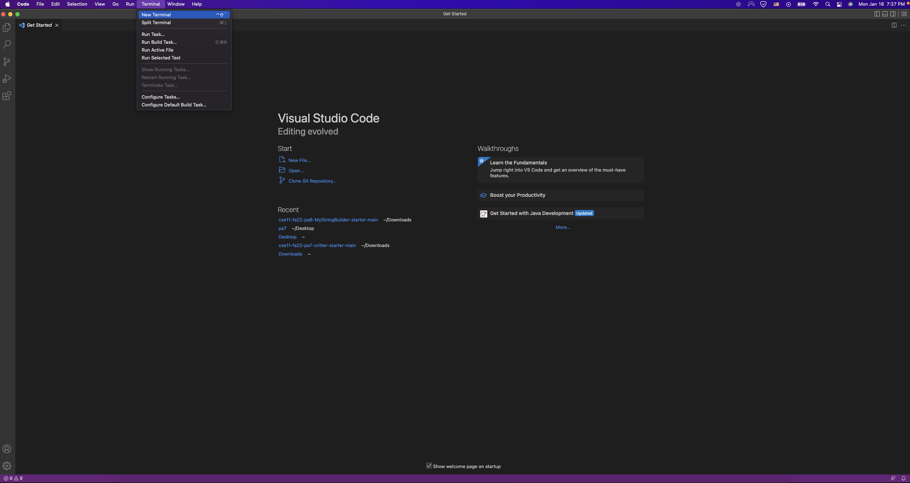
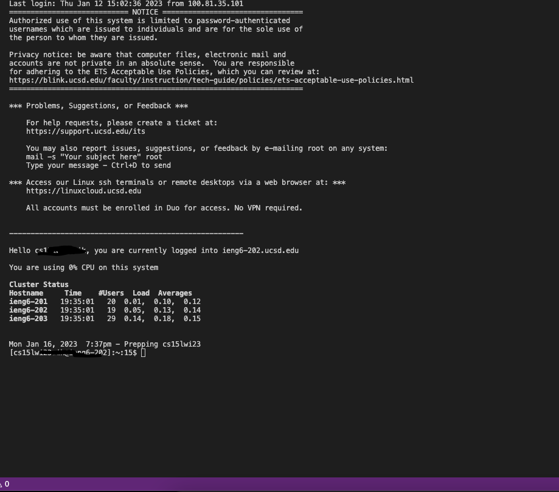
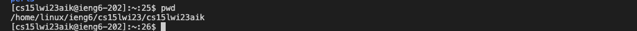

# **Lab Report 1**
## **Downloading VSCode**
First, you want to visit [VSCode](https://code.visualstudio.com/download)

1. Download your computer's operating system version. 
2. For the sake of simplicity, we will use **macOS**.

After downloading, you should see this screen:

## **Remotely Connecting**
Before we actually use VSCode, we must first reset our CSE15L account password.

Here is a guide: https://docs.google.com/document/d/1hs7CyQeh-MdUfM9uv99i8tqfneos6Y8bDU0uhn1wqho/edit

Now, we want to access the terminal in VSCode. To do this:
1. Enter VSCode
2. Click **Terminal** on the top left corner
3. Select *New Terminal*

Now we want to type in a command into the terminal: 
`$ ssh cs15lwi23zz@ieng6.ucsd.edu`

Note: We don't type in "$" and replace "zz" with the letters in your course account.

If it is your first time doing this, you will get this message:\
`The authenticity of host 'ieng6.ucsd.edu (128.54.70.227)' can't be established.
RSA key fingerprint is SHA256:ksruYwhnYH+sySHnHAtLUHngrPEyZTDl/1x99wUQcec.
Are you sure you want to continue connecting (yes/no/[fingerprint])?`

Type in **yes**

Now you'll get asked to input your password. You won't actually see the characters you input, so carefully type it in.

You should now see this:

## **Commands**
Here are some commands to you can try:

* cd
* ls
* pwd
* mkdir
* cp

If you want to exit the remote server type in the command: `exit`

Some examples of commands I use are: 

