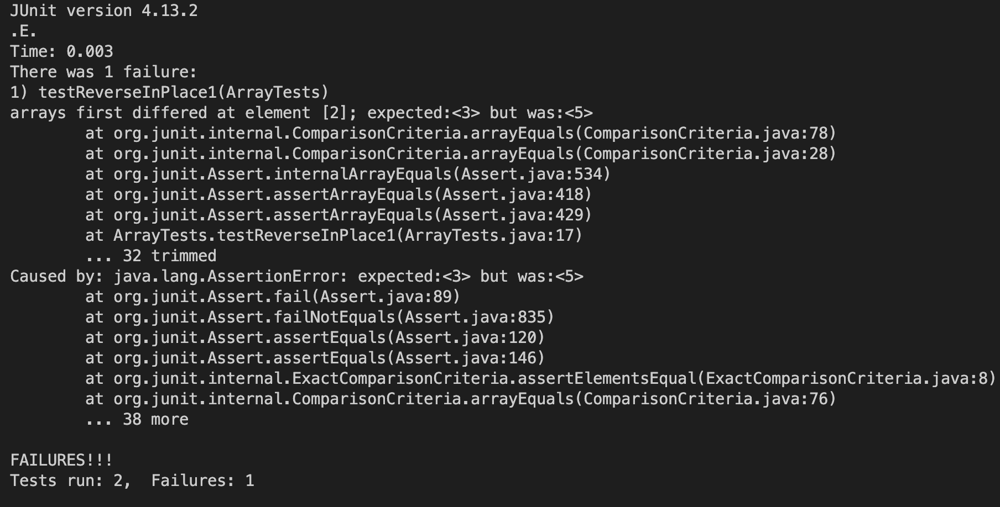

## Part 1
Code: 
```java
import java.io.IOException;
import java.net.URI;

class Handler implements URLHandler {
    // The one bit of state on the server: a number that will be manipulated by
    // various requests.
    String str = "";

    public String handleRequest(URI url) {
        System.out.println("Path: " + url.getPath());
        if (url.getPath().contains("/add-message")) {
            String[] parameters = url.getQuery().split("=");
            if (parameters[0].equals("s")) {
                str += parameters[1] + "\n";
                return String.format(str);
            }
        }
            return "404 Not Found";
    }
}

    


class StringServer {
    public static void main(String[] args) throws IOException {
        if(args.length == 0){
            System.out.println("Missing port number! Try any number between 1024 to 49151");
            return;
        }

        int port = Integer.parseInt(args[0]);

        Server.start(port, new Handler());
    }
}
```

Screenshots: 

* handleRequest, getPath, getQuery().split() were all called.
* handleRequests gets http://localhost:400/add-message?s=Hello, the url, getPath gets "/add-message", path part of url, getQuery.split "=", the part of url after the =. 
* The value of str gets changed because the user inputs "How are you", which adds on to the "Hello". 


* handleRequest, getPath, getQuery().split() were all called.
* handleRequests gets http://localhost:400/add-message?s=gg=gg, the url, getPath gets "/add-message", path part of url, getQuery.split "=", the part of url after the =. 
* The value of str gets changed because the user inputs "gg=gg". It only adds the first "gg" because the second one is index 2 of the parameter list.

## Part 2

* A failure-inducing input:
```java
@Test 
public void testReverseInPlace() {
    int[] input1 = { 3, 4, 5 };
    ArrayExamples.reverseInPlace(input1);
    assertArrayEquals(new int[]{ 5, 4, 3 }, input1);
}
```
* An input that doesn't induce failure: 
```java
@Test 
public void testReverseInPlace() {
    int[] input1 = { 3 };
    ArrayExamples.reverseInPlace(input1);
    assertArrayEquals(new int[]{ 3 }, input1);
}
```
* The symptom, as the output of running test:


* The bug, before and after fixing it:
Before:
```java
static void reverseInPlace(int[] arr) {
    for(int i = 0; i < arr.length; i += 1) {
      arr[i] = arr[arr.length - i - 1];
    }
  }
```
After:
```java
static void reverseInPlace(int[] arr) {
    int[] newArray = new int[arr.length];
    newArray[0] = arr[arr.length-1];
    for(int i = 1; i < arr.length; i += 1) {
      newArray[i] = arr[arr.length-i-1];
    }
    for(int k = 0; k < arr.length; k++) {
      arr[k] = newArray[k];
    }
  }
```
These changes fixed the bug because it creates a new array and copies the data from the orginal array reversely. Then I take the new array and copies its data directly into the original array.
