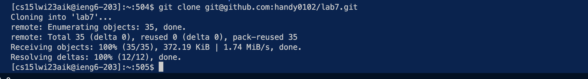
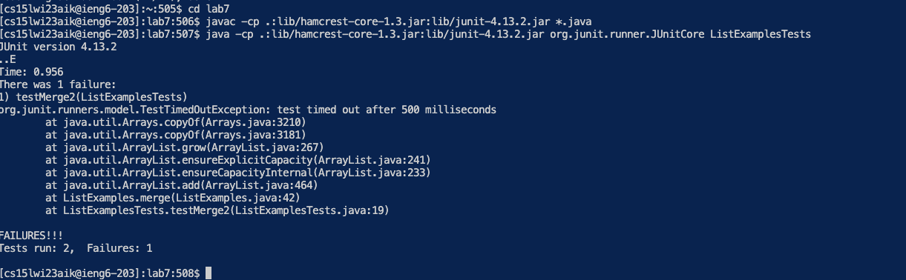
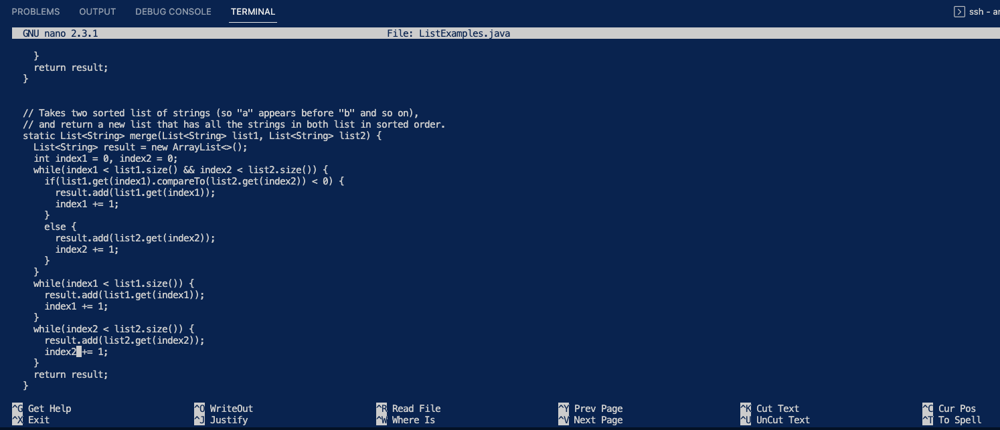
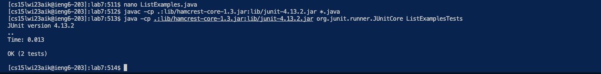
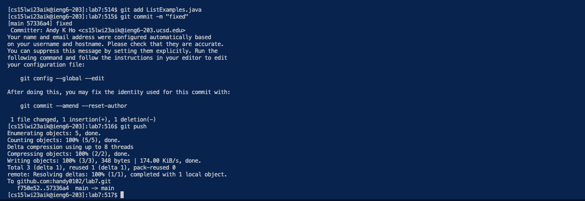

# Lab Report 4

Before I start, I have a document opened up on the side with all the commands I need so I can copy and paste it into the terminal. 

It looks something like this:
* `ssh cs15lwi23aik@ieng6.ucsd.edu`
* `git clone git@github.com:handy0102/lab7.git`
* `javac -cp .:lib/hamcrest-core-1.3.jar:lib/junit-4.13.2.jar *.java java -cp .:lib/hamcrest-core-1.3.jar:lib/junit-4.13.2.jar org.junit.runner.JUnitCore ListExamplesTests`

## Step 4 - Logging onto ieng6:
1. double click on `ssh cs15lwi23aik@ieng6.ucsd.edu`
2. `<command><c>`
3. click back onto the terminal
4. `<command><v>`, `<enter>`

I copied and pasted the command to login into ieng6 on the terminal here.
  
## Step 5 - cloning repo:
1. double click on `git clone git@github.com:handy0102/lab7.git`
2. `<command><c>`
3. click on back onto terminal
4. `<command><v>`, `<enter>`

I copied and pasted the git clone command to clone the lab7 repo.

## Step 6 - Run tests (fail)
1. I typed in `cd l`, then pressed `<tab>`, then `<enter>`. (Note: this will only work if lab7 is the only directory starting with "l").
2. double click on `javac -cp .:lib/hamcrest-core-1.3.jar:lib/junit-4.13.2.jar *.java`
3. `<command><c>`
4. click back onto terminal
5. `<command><v>`, `<enter>`
6. double click on `java -cp .:lib/hamcrest-core-1.3.jar:lib/junit-4.13.2.jar org.junit.runner.JUnitCore ListExamplesTests`
7. `<command><c>`
8. click back onto terminal
9. `<command><v>`, `<enter>`

I changed the directory into lab7 by typing "cd l", then auto filling it to "lab7". Then I copied and paste the commands to compile and run the testers.

## Step 7 - Fix Code
1. type `nano L`, `<tab>`
2. then add a `.j`, `<tab>`, `<enter>`
3. `<ctrl><O>`, `<enter>`
4. scroll down to the last while loop
5. then scroll down to until you reach the line with "index1" increment
6. Press `<right>` key 12 times
7. `<delete>` once and type `2`
8. `<ctrl><x>`, `<y>`, `<enter>`

I shortern the time to type `nano ListExamples.java` by using tab after "L" and after ".j". I use my scroll wheel to quickly get to the last while loop where index1 increment is actually suppose to be index2. To reach that index1, I have to press the `<left>` arrow key 12 times. Then I save the changes using number 8's commands.

## Step 8 - Run tests (again)
1. `<up>` three times.
2. `<enter>`
3. `<up>` three times.
4. `<enter>`

This step requires you to reuse the same commands from step 6. We can use the up arrow key to use them again.

## Step 9 - Committing and pushing
1. Type `git add L`, `<tab>`, then type `.j`, `<tab>`, `<enter>`
2. Type `git commit -m "fixed"`
3. Type `git push`

This step uses two `<tab>` to quickly autofill to ListExamples.java. Then the rest of the steps commits and pushes the changes to ListExamples.java onto the repo.
